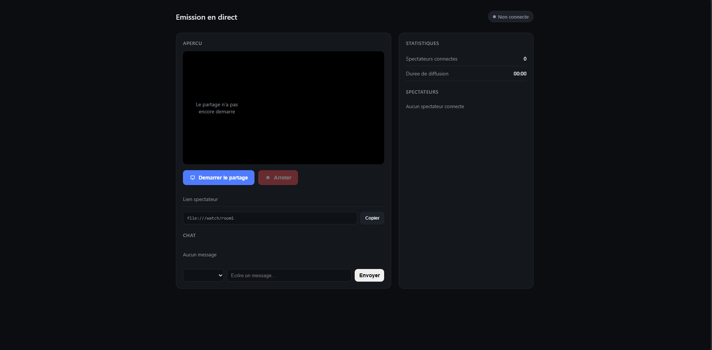
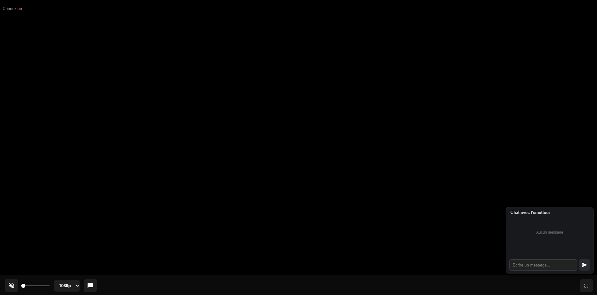

# Screenshare Privé

Partage d'écran privé en direct via **WebRTC**, avec un lien émetteur protégé par token et un lien spectateur à partager (1 émetteur → plusieurs spectateurs).

<p align="center">
  
  
  
  
  
</p>

<p align="center">
  <a href="https://github.com/issaMrt/screenshare-public/archive/refs/heads/main.zip">
    
  </a>
</p>

---

## Fonctionnalités

- Partage d'écran en direct (vidéo + audio) via WebRTC, sans passer par un serveur tiers pour le flux
- Lien émetteur protégé par un **token secret** (comparaison en temps constant, anti-brute-force avec blocage IP)
- Lien spectateur unique à partager (`/watch/room1`)
- Chat en direct entre l'émetteur et chaque spectateur
- Notes par spectateur (ex : prénom), sauvegardées et conservées entre les redémarrages
- Sélecteur de qualité côté spectateur (480p / 720p / 1080p)
- Protections réseau : rate limiting HTTP, limite de connexions WebSocket par IP, en-têtes de sécurité (anti-clickjacking, anti-iframe)
- Script `start.bat` pour tout lancer en un clic sous Windows (serveur + tunnel ngrok + navigateur)

## Captures d'écran

<p align="center">
  
  
</p>
<p align="center">
  <sub><b>Page émetteur</b> (gauche), <b>page spectateur</b> (droite)</sub>
</p>

## Stack technique

| Composant | Technologie |
|---|---|
| Serveur web | [Node.js](https://nodejs.org) + [Express](https://expressjs.com) |
| Signalisation temps réel | [ws](https://github.com/websockets/ws) (WebSocket) |
| Flux vidéo/audio | [WebRTC](https://webrtc.org) (peer-to-peer) |
| Variables d'environnement | [dotenv](https://github.com/motdotla/dotenv) |
| Protection anti-flood | [express-rate-limit](https://github.com/express-rate-limit/express-rate-limit) |
| Tunnel public (optionnel) | [ngrok](https://ngrok.com) |
| Frontend | HTML / CSS / JavaScript vanilla |

---

## Installation (pas à pas)

Ces étapes fonctionnent sur n'importe quelle machine (pas besoin d'être sur le PC d'origine).

### 1. Installer les prérequis

- **[Node.js](https://nodejs.org/)** version 18 ou plus récente (inclut `npm`)
- **[Git](https://git-scm.com/downloads)** (optionnel, seulement pour cloner via ligne de commande)
- **[ngrok](https://ngrok.com/download)** (optionnel, seulement si tu veux partager le lien en dehors de ton réseau local)

Pour vérifier que Node.js est bien installé :
```bash
node -v
npm -v
```

### 2. Récupérer le projet

**Option A, avec Git :**
```bash
git clone https://github.com/issaMrt/screenshare-public.git
cd screenshare-public
```

**Option B, sans Git :** clique sur le bouton **⬇️ Télécharger le projet** en haut de ce README, décompresse le fichier `.zip`, puis ouvre un terminal dans le dossier obtenu.

### 3. Installer les dépendances

```bash
npm install
```

### 4. Créer le fichier `.env`

Un fichier `.env.example` est fourni comme modèle. Copie-le en `.env` :

```bash
# macOS / Linux
cp .env.example .env

# Windows (invite de commandes)
copy .env.example .env
```

Ouvre ensuite `.env` et renseigne au minimum :

```env
BROADCASTER_TOKEN=choisis-un-token-long-et-secret
PORT=3000
```

Le `BROADCASTER_TOKEN` est ta clé d'accès à la page émetteur (`/sender?token=...`) : ne le partage avec personne, et ne commit jamais le fichier `.env` (il est déjà exclu via `.gitignore`).

### 5. Lancer le serveur

```bash
npm start
```

Le serveur démarre sur **http://localhost:3000**. La console affiche directement :
- le lien émetteur (avec le token) à ouvrir toi-même
- le lien spectateur (`/watch/room1`) à envoyer aux autres

> Sous Windows, tu peux aussi double-cliquer sur **`start.bat`** : il lance le serveur, ouvre un tunnel ngrok (si configuré) et ouvre directement la page émetteur dans Edge.

### 6. Partager le flux en dehors du réseau local (optionnel)

Si tes spectateurs ne sont pas sur ton réseau, utilise ngrok pour exposer le serveur publiquement :

```bash
ngrok http 3000
```

Ajoute alors le domaine ngrok obtenu (ex : `mon-tunnel.ngrok-free.app`) dans ton `.env` :

```env
NGROK_DOMAIN=mon-tunnel.ngrok-free.app
```

Cela autorise ce domaine à ouvrir des connexions WebSocket vers ton serveur (protection anti cross-site).

---

## Sécurité

- Le token émetteur est comparé en temps constant et protégé par un système de blocage après plusieurs tentatives ratées (5 échecs → blocage 15 minutes)
- Aucune page sensible n'est servie sans le bon token (pas de fuite d'information)
- Le fichier `.env` (token, domaine ngrok) n'est jamais versionné sur Git
- Les en-têtes `X-Frame-Options`, `Content-Security-Policy` et `X-Content-Type-Options` empêchent l'intégration du site dans un iframe tiers
- Un nombre maximum de spectateurs et de connexions par IP est appliqué pour éviter les abus

## Capturer l'audio d'une seule application (ex : un jeu)

Par défaut, `getDisplayMedia` (utilisé par la page émetteur) capture le **son système global**, pas le son d'une application précise. Deux méthodes pour isoler l'audio d'un seul jeu/app :

### Méthode simple : partager la fenêtre, pas l'écran

Sur Chrome/Edge (Windows), si tu partages **la fenêtre de l'application** plutôt que "Tout l'écran" dans la fenêtre de sélection, le navigateur peut isoler automatiquement le son de cette fenêtre. Ça ne fonctionne pas toujours :
- Si le jeu tourne en **plein écran exclusif**, il n'apparaît pas comme une fenêtre partageable dans certains cas. Passe le jeu en mode **"Plein écran fenêtré" / "Borderless"** dans ses options graphiques pour qu'il apparaisse comme une fenêtre normale.
- Sur **Edge**, la case à cocher "Partager l'audio de l'onglet/de la fenêtre" ne s'affiche que pour un onglet Chrome/Edge ou une fenêtre spécifique. Elle est **grisée ou absente quand tu choisis "Tout l'écran"**, car dans ce cas le navigateur ne peut capturer que le son global du système, pas celui d'une fenêtre.
- Le comportement varie selon la version du navigateur : teste avant l'émission en direct.

### Méthode fiable : VB-Cable (ou Voicemeeter)

Si le partage de fenêtre ne capture pas l'audio correctement, route uniquement l'app voulue vers un périphérique audio virtuel :

1. Installe **[VB-CABLE](https://vb-audio.com/Cable/)** (gratuit) et redémarre le PC.
2. Ouvre le **Mélangeur de volume** Windows (Paramètres > Système > Son > Mélangeur de volume, ou clique droit sur l'icône haut-parleur).
3. Trouve ton jeu dans la liste et change sa **sortie** de "Casque" vers **"CABLE Input"**. Laisse toutes les autres apps (navigateur, Discord...) sur ta sortie normale.
4. Pour continuer à entendre le jeu toi-même : Panneau de configuration > Son > onglet Enregistrement > double-clic sur **CABLE Output** > onglet Écouter > coche **"Écouter ce périphérique"** > choisis ton casque en sortie.
5. Dans la page émetteur, partage l'écran/la fenêtre avec **"Partager l'audio"** coché. Comme le jeu est maintenant la seule source routée sur CABLE, seul son son est capturé.

⚠️ Cette méthode ajoute un léger délai audio (latence de traitement) :

| Configuration | Délai approximatif |
|---|---|
| VB-Cable + "Écouter ce périphérique" | ~30 à 70 ms |
| [Voicemeeter](https://vb-audio.com/Voicemeeter/) en mode ASIO | ~5 à 15 ms |
| Voicemeeter en mode WDM | ~20 à 40 ms |
| Voicemeeter en mode MME | ~50 à 100 ms (à éviter) |

Si tu ressens un décalage entre l'image et le son du jeu et veux le réduire, remplace VB-Cable seul par **Voicemeeter** : il fait le mixage et la capture en une seule passe au lieu de deux, ce qui réduit nettement la latence. Le mode ASIO (si ta carte son/casque le supporte) donne le meilleur résultat.

Pour mesurer objectivement le délai plutôt qu'à l'oreille : ouvre `chrome://webrtc-internals` sur la page spectateur pendant l'émission, cherche la section `RTCInboundRTPAudioStream`, et calcule `jitterBufferDelay ÷ jitterBufferEmittedCount × 1000` pour obtenir le délai en millisecondes.

## Structure du projet

```
screenshare-public/
├── server.js            # Serveur Express + WebSocket (signalisation WebRTC)
├── public/
│   ├── sender.html       # Page émetteur (protégée par token)
│   └── viewer.html       # Page spectateur
├── docs/                 # Captures d'écran utilisées dans ce README
├── start.bat             # Lancement rapide sous Windows
├── package.json
├── .env.example           # Modèle de configuration
├── .gitattributes         # Normalisation des fins de ligne
└── .gitignore
```

---

## Licence

Projet à usage privé. Libre à toi d'adapter la licence selon tes besoins avant de rendre le dépôt public.
